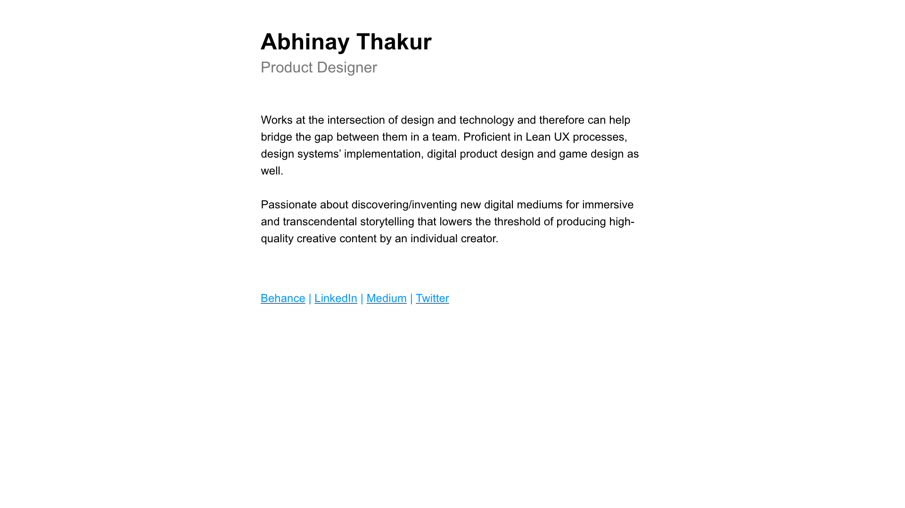

# thisisabhinay.github.io
Personal website of the author to demonstrate work experience, portfolio, thoughts & ideas on favourite topics etc.

**Alias:** [thisisabhinay.com](https://thisisabhinay.com)

## Motivation
To create a centeralised/personal space on web for author which:
- Provide one-point access to potential visitors of his other profiles on various networks and platforms like Behance, LinkedIn, Twitter etc.
- Act as a portfolio demonstrating the work experience and process of the author.
- Communicates thoughts and ideas related to latest happenings in the industry in form of a blog.

## Build Status

## Code Style

**Horizontal indents:** 4 spaces.

## Screenshots

## Tech/Framework used
